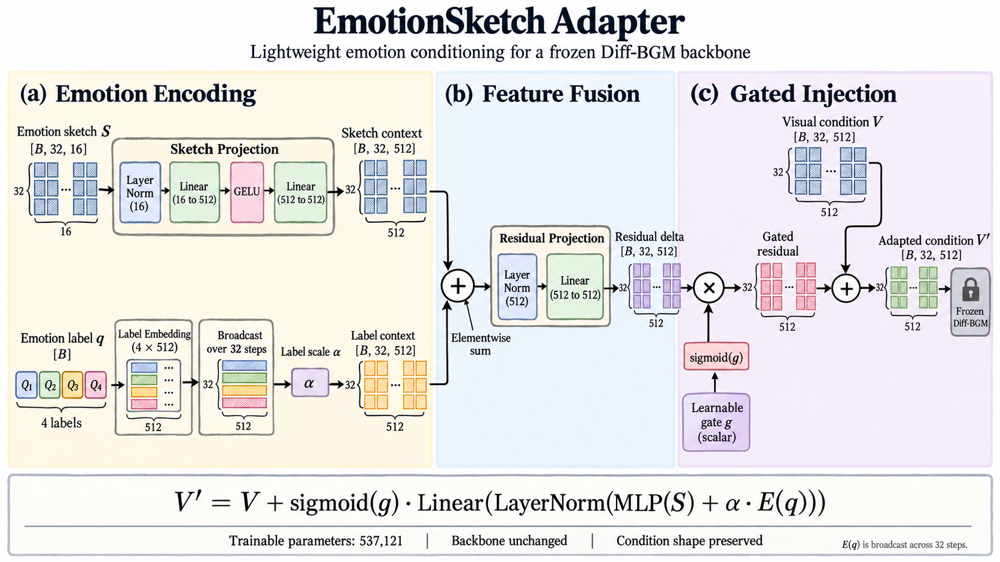

<div align="center">

# EmotionSketch-BGM

### One video. Different emotions. Symbolic background music.

Emotion sketch adaptation · Natural-language control · MIDI-based evaluation

[简体中文](README.md) · **English**

**[Contributions](#contributions)** &nbsp; / &nbsp; **[Method](#method)** &nbsp; / &nbsp; **[Results](#results)** &nbsp; / &nbsp; **[Quick Start](#quickstart)** &nbsp; / &nbsp; **[Code](#code)**

</div>

EmotionSketch-BGM connects natural-language emotion intent to symbolic music generation through a lightweight adapter on frozen **Diff-BGM**. Three modules organize the work: **MFAE emotion evaluation, EmotionSketch condition adaptation, and Prompt-to-Q text routing**.

<table align="center">
<tr>
<td align="center" width="300">
<h3>537,121</h3>
<b>Trainable parameters</b><br>
<sub>Gated residual adapter</sub>
</td>
<td align="center" width="300">
<h3>1.295%</h3>
<b>Relative to backbone</b><br>
<sub>Frozen Diff-BGM</sub>
</td>
<td align="center" width="300">
<h3>32.17% → 33.70%</h3>
<b>Target-quadrant hit rate</b><br>
<sub><b>+1.53 pp</b> at matched budgets</sub>
</td>
</tr>
</table>



*Adapter architecture: continuous emotion sketches and discrete labels are fused and injected into visual conditions through a learned gate. Click the image to view it at full resolution.*

> **Experimental evidence** · 100 validation video clips; 20,400 MIDI candidates each for Adapter and baseline. MFAE defines target hits, measured before best-candidate selection; pp denotes percentage points. [May 2026 experiment records →](docs/results-summary.json)

---

<a id="contributions"></a>
## 01 · Contributions

### 01 · MFAE MIDI emotion evaluator

A KNN classifier trained on 48 EMOPIA MIDI features provides four-quadrant emotion classification. MFAE serves as a shared scoring criterion for comparing the emotion sketch adapter against the no-adapter baseline and for selecting target MIDI candidates.

### 02 · Parameter-efficient EmotionSketch-BGM adapter

Continuous 16-dimensional sketches and discrete Q-label embeddings are mapped into a 512-dimensional condition space. A learned gate injects the residual into the frozen Diff-BGM visual condition path. The adapter contains 537,121 trainable parameters, equivalent to 1.295% of the frozen backbone.

### 03 · Prompt-to-Q natural-language router

A character n-gram linear softmax classifier maps descriptions such as “bright and excited,” “tense and intense,” “sad and low,” and “calm and soothing” to Q1–Q4 probabilities and then an adapter emotion label. The implemented router processes Chinese prompts, runs on the Python standard library, and requires no online LLM calls.

---

<a id="method"></a>
## 02 · Method & Pipeline


*The diagram shows component interfaces. Current music experiments use pre-extracted features and reference symbolic music for teacher-forced conditional denoising; router predictions connect through the label interface.*

### 1. Express emotion through a shared control signal

| Quadrant | Valence | Arousal | Example intent | Label ID |
| --- | --- | --- | --- | :---: |
| Q1 | Positive | High | Joyful, excited, triumphant | 0 |
| Q2 | Negative | High | Tense, oppressive, conflict-driven | 1 |
| Q3 | Negative | Low | Sad, lonely, melancholic | 2 |
| Q4 | Positive | Low | Warm, calm, soothing | 3 |

<details>
<summary>Training labels and ID conventions</summary>

EMOPIA quadrant centroids supply pseudo-labels during adapter training. At use time, a target can be predicted by Prompt-to-Q or specified explicitly. The `proxy` mode is a within-batch threshold baseline; its IDs do not directly represent EMOPIA quadrants.

</details>

### 2. Adapt visual conditions with a gated residual

Each sample receives a **32 × 16** sketch combining note activity, register statistics, chord summaries, visual/caption feature norms, shot count, and valence/arousal proxies. For visual conditions `V`, sketch `S`, and target label `q`:

```math
V' = V + \sigma(g)\,f_{\mathrm{out}}\!\left(f_{\mathrm{sketch}}(S) + \alpha E(q)\right)
```

`E(q)` is broadcast over time, α corresponds to `label_scale`, and `g` is a learned gate. Input and output both have shape **[B, 32, 512]**. Training updates the adapter while retaining the backbone's denoising objective.

<details>
<summary>Parameter breakdown</summary>

| Component | Parameters |
| --- | ---: |
| EmotionSketch Adapter | **537,121** |
| Frozen Diff-BGM SDF backbone | 41,479,098 |
| Adapter / backbone ratio | **1.295%** |

</details>

### 3. Use emotion features to guide candidate selection

MFAE establishes an emotion-scoring space using **48 EMOPIA MIDI features**, including pitch, duration, velocity, and rhythm statistics. A KNN classifier assigns MIDI samples to Q1–Q4 emotion quadrants.

Candidate evaluation combines neighborhood probabilities and centroid scores to measure alignment with the requested emotion and select a matching MIDI candidate. MFAE also supplies a shared criterion for comparing target-quadrant hits between Adapter and no-adapter conditions, connecting lightweight conditioning to interpretable output evaluation.

---

<a id="results"></a>
## 03 · Experiments & Results

| Research question | Key result |
| --- | --- |
| **Can MFAE recognize emotion?** | Accuracy **0.6279**; Macro-F1 **0.6285** |
| **Does Q-label change the condition output?** | Full RMSE **0.099496**; **0** with the label branch disabled |
| **Do candidates shift toward the target?** | **312** additional target hits at the same budget |
| **Can text map to emotion labels?** | Prompt-to-Q Accuracy **1.0000** on 100 cleaned validation prompts |

### MFAE: four-quadrant MIDI emotion classification

**Setup.** Train a KNN classifier on EMOPIA MIDI features and evaluate four-quadrant recognition on the validation split. Use the resulting MFAE as the shared evaluator in the adapter comparisons.

| Metric | Value |
| --- | ---: |
| Accuracy | **0.6279** |
| Macro-F1 | **0.6285** |

<details>
<summary>Recall by quadrant</summary>

| Quadrant | Recall |
| --- | ---: |
| Q1 | 0.7755 |
| Q2 | 0.6038 |
| Q3 | 0.5294 |
| Q4 | 0.6129 |

</details>

Accuracy measures correct classifications, Macro-F1 averages F1 across four classes, and Recall measures recovery within each quadrant. MFAE provides a consistent classification and evaluation criterion for generated candidates.

### Experiment 1: can the Q-label emotion-control path intervene in generation?

**Setup.** Hold the visual features and emotion sketch of the same video sample fixed. Force the input label to Q1/Q2/Q3/Q4 and examine whether the adapter's condition output changes. Compare full, label-only, and sketch-only settings.

| Adapter setting | Label path | Mean pairwise condition RMSE |
| --- | --- | ---: |
| **full (label + sketch)** | enabled | **0.099496** |
| label-only | enabled | 0.110717 |
| sketch-only | disabled | 0.000000 |

**Metric.** Compute the root mean square error (RMSE) between condition outputs for each pair of Q-labels, then average. A larger value indicates a stronger effect of label switching on the condition output.

**Conclusion.** Forcing Q1–Q4 changes the condition outputs of full and label-only adapters, while sketch-only remains invariant. This confirms that **the Q-label branch enters the generation condition path**, establishing an explicit emotion-control interface.

### Experiment 2: Adapter vs no-adapter—candidates shift toward the target quadrant

**Setup.** Use **100 BGM909 validation video clips**, assign a target Q-label to each clip, and generate MIDI candidates with the adapter and no-adapter baseline. MFAE classifies each candidate; a hit occurs when its predicted quadrant matches the target label. Both conditions use identical candidate budgets, with **20,400 MIDI candidates per condition**. Hits are measured before best-candidate selection.

| Target | Budget | Adapter hit / rate | Baseline hit / rate | Delta |
| --- | ---: | ---: | ---: | ---: |
| Q1 | 2,400 | **865 / 0.3604** | 794 / 0.3308 | **+2.96 pp** |
| Q2 | 2,400 | **1,448 / 0.6033** | 1,422 / 0.5925 | **+1.08 pp** |
| Q3 | 4,000 | 4,000 / 1.0000 | 4,000 / 1.0000 | 0.00 pp |
| Q4 | 11,600 | **561 / 0.0484** | 346 / 0.0298 | **+1.85 pp** |
| **Overall** | **20,400** | **6,874 / 0.3370** | **6,562 / 0.3217** | **+1.53 pp** |

**Conclusion.** Across 100 validation clips and 20,400 MIDI candidates per condition, the adapter raises the overall target-quadrant hit rate from **0.3217 to 0.3370**, producing **312 additional target-hit candidates** at the same budget. The emotion sketch adapter shifts the candidate distribution toward the requested quadrant.

*Overall is weighted by the per-quadrant candidate counts; pp denotes percentage points, and differences are calculated from the original counts.*

### Prompt-to-Q: natural-language emotion-label classification

**Setup.** Use LLM-assisted generation of natural-language emotion descriptions and Q-labels, followed by cleaning and balancing across Q1–Q4. Train the lightweight router on **400 prompts** and compare it against a keyword-rule baseline on **100 cleaned validation prompts**.

| Split | Model | Accuracy | Macro-F1 |
| --- | --- | ---: | ---: |
| validation | **lightweight router** | **1.0000** | **1.0000** |
| validation | rule baseline | 0.6600 | 0.6430 |

**Conclusion.** On this cleaned validation split, the lightweight router correctly maps natural-language descriptions to emotion labels, providing a structured entry point for user intent that connects to the adapter's Q-label interface.

### Project conclusions

EmotionSketch-BGM organizes video-music emotion control into three verifiable modules: **MFAE supplies emotion classification, the adapter supplies a lightweight condition-control path, and Prompt-to-Q supplies the natural-language interface**. Label intervention verifies the control branch, and the candidate comparison shows that this path shifts MIDI candidate distributions toward the target emotion.

[Aggregate results, confusion matrices, and source records →](docs/results-summary.json)

---

<a id="quickstart"></a>
## 04 · Quick Start

Run the Chinese rule-based routing example without additional dependencies:

```bash
PYTHONPATH=Experiment/core_code python3 - <<'PY'
from emotionsketch.prompt_router import rule_predict
print(rule_predict("温暖平静的背景音乐"))  # Q4
PY
```

This example uses the rule baseline; Prompt-to-Q results above use the trained classifier. Music modules use **PyTorch / NumPy / pretty_midi**. The full workflow requires Diff-BGM, datasets, and model weights.

**[Installation, router training, adapter training, and decoding commands →](docs/USAGE.en.md)**

---

<a id="code"></a>
## 05 · Code Map

| Capability | Implementation |
| --- | --- |
| Gated emotion adaptation | [model.py](Experiment/core_code/emotionsketch/model.py) |
| 16-dimensional sketches and EMOPIA pseudo-labels | [data.py](Experiment/core_code/emotionsketch/data.py) |
| Chinese prompt training and prediction | [prompt_router.py](Experiment/core_code/emotionsketch/prompt_router.py) |
| Adapter training on a frozen backbone | [emotionsketch_adapter_train.py](Experiment/core_code/scripts/emotionsketch_adapter_train.py) |
| MIDI evaluator training / scoring | [MFAE training](Experiment/core_code/scripts/train_emopia_midi_quadrant_evaluator_v3.py) · [Manifest scoring](Experiment/core_code/scripts/score_midi_manifest_v3.py) |
| Candidate generation and selection | [Candidate generation](Experiment/core_code/scripts/guided_decode_rerank_demo.py) · [Controlled export](Experiment/core_code/scripts/constrained_decode_eval_demo.py) · [Feature search](Experiment/core_code/scripts/q4_profile_search_v3.py) |
| Intervention and parameter analysis | [Label intervention](Experiment/core_code/scripts/evaluate_label_intervention_sensitivity.py) · [Parameter count](Experiment/core_code/scripts/summarize_parameter_efficiency.py) |

The repository contains **18 core source files** with project and reproduction documentation. Raw data, weights, candidate MIDI files, logs, and third-party repositories are prepared separately. Reported metrics are archived experiment results; training was not rerun for this documentation update.

## Acknowledgements

The video-music backbone builds on [Diff-BGM](https://github.com/sizhelee/Diff-BGM), and emotion data comes from [EMOPIA](https://github.com/annahung31/EMOPIA). The project-specific [shot-count patch](patches/diffbgm-shot-count.patch) is included. Third-party resources retain their own usage terms; this repository has not specified an open-source license.

<p align="center">
<a href="#emotionsketch-bgm">Back to top</a> · <a href="docs/USAGE.en.md">Usage guide</a> · <a href="docs/results-summary.json">Experiment records</a>
</p>
