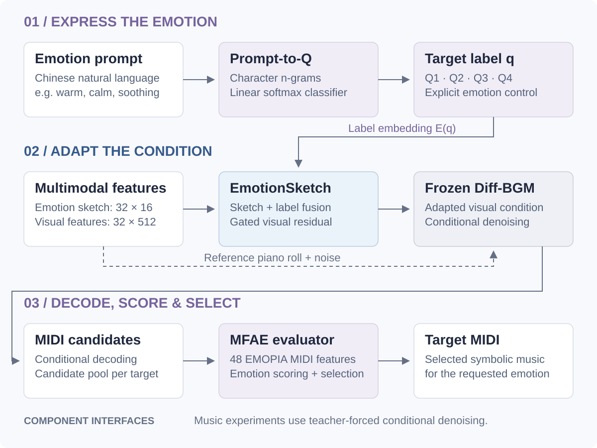

<div align="center">

# EmotionSketch-BGM

### 用自然语言表达情绪，让视频配乐拥有可解释的控制接口

**情绪草图适配器 · 符号音乐生成 · 评价器引导解码**

**简体中文** | [English](README.en.md)

[核心贡献](#contributions) · [方法与流程](#method) · [实验结果](#results) · [快速开始](#quickstart) · [代码导航](#code)

</div>

---

EmotionSketch-BGM 是一个面向视频背景音乐的情绪控制研究项目。围绕“同一视频如何表达不同情绪”，项目将**文本情绪路由、轻量条件适配和 MIDI 评价引导**组织成一套可检查、可训练、可比较的研究流程。

在冻结的 Diff-BGM 骨干上，EmotionSketch 以 **537,121 个可训练参数**注入情绪条件；在 100 个验证片段的同预算实验中，候选池目标象限命中率从 **32.17% 提升至 33.70%**。文本前端在 80 条人工整理的中文压力测试提示上达到 **0.8335 Macro-F1**。

| 轻量适配 | 文本情绪理解 | 候选分布控制 | 实验规模 |
| :---: | :---: | :---: | :---: |
| **1.295%** | **0.8335** | **+1.53 pp** | **20,400 × 2** |
| 适配器 / 冻结骨干参数比 | 中文压力测试 Macro-F1 | MFAE 目标命中率提升 | 适配器与基线各自的候选数 |

> 数据来自 2026 年 5 月项目实验。命中率按 MFAE 评价器定义，统计于最佳候选筛选之前；`pp` 表示百分点。[查看汇总数据与来源记录 →](docs/results-summary.json)

<a id="contributions"></a>
## 核心贡献

**01 · 参数高效的情绪控制接口**<br>
设计 EmotionSketch Adapter，将 16 维分段草图与四象限标签嵌入映射为门控残差，注入 512 维视觉条件。保持骨干冻结与条件张量尺寸不变，以 53.7 万参数扩展情绪控制能力。

**02 · 从特征诊断到解码策略**<br>
构建基于 EMOPIA 的 48 维 MIDI 情绪评价器（MFAE），将音高、时值、力度、节奏等统计特征用于候选评分；结合 Q1/Q2 重排序、Q3 受控导出和 Q4 定向参数搜索，形成可复用的四象限解码流程。

**03 · 轻量自然语言前端**<br>
实现字符 n-gram 与线性 softmax 分类器，将中文情绪提示转为 Q1–Q4 概率分布，与适配器标签接口对接。路由器运行仅依赖 Python 标准库，无需在线调用大语言模型。

**04 · 分离条件响应与筛选收益的实验设计**<br>
通过标签干预、同预算无适配器对照和筛选前候选统计，分别衡量控制分支是否生效、适配器是否改变候选分布，以及完整筛选流程的覆盖情况。

<a id="method"></a>
## 方法设计与 Pipeline



*图中展示组件接口关系。当前音乐实验基于预提取特征与参考符号音乐的 teacher-forced 条件去噪；文本路由器输出通过标签接口接入。*

### 1. 将情绪意图转成统一控制信号

| 象限 | 效价 | 唤醒度 | 情绪示例 | 标签编号 |
| --- | --- | --- | --- | :---: |
| Q1 | 正 | 高 | 欢快、兴奋、胜利 | 0 |
| Q2 | 负 | 高 | 紧张、压迫、冲突 | 1 |
| Q3 | 负 | 低 | 悲伤、孤独、忧郁 | 2 |
| Q4 | 正 | 低 | 温暖、平静、舒缓 | 3 |

训练阶段通过 EMOPIA 象限质心提供伪标签；使用阶段可由 Prompt-to-Q 预测或显式指定目标标签。`proxy` 是批内阈值基线，其编号不直接对应 EMOPIA 象限。

### 2. 用门控残差适配视觉条件

每个样本构建 **32 × 16** 草图，涵盖音符活动、音区分布、和弦汇总、视觉/字幕特征范数、镜头计数与效价/唤醒代理量。设视觉条件为 `V`、草图为 `S`、目标标签为 `q`：

```math
V' = V + \sigma(g)\,f_{\mathrm{out}}\!\left(f_{\mathrm{sketch}}(S) + \alpha E(q)\right)
```

`E(q)` 在时间维广播，α 对应 `label_scale`，`g` 是可学习门控。输入与输出均为 **[B, 32, 512]**；训练更新适配器，保留骨干去噪目标。

### 3. 将情绪特征转成候选选择依据

| 目标 | 解码策略 | 主要控制量 |
| --- | --- | --- |
| Q1 / Q2 | 条件候选生成 + MFAE 重排序 | 标签强度、噪声、时间步、二值化阈值 |
| Q3 | 符号约束 + 标签感知导出 | 音符密度、时值、力度与速度 |
| Q4 | 基于特征诊断的定向搜索 | 音域、中音区占比、时值、力度与速度 |

MFAE 使用 EMOPIA MIDI 的 48 维特征建立情绪评分依据。解码阶段结合邻域概率与质心分数选择目标候选，使生成条件和符号音乐特征之间具有明确的诊断接口。

<a id="results"></a>
## 实验结果

### A. 参数效率与条件响应

| 项目 | 结果 |
| --- | ---: |
| 冻结 Diff-BGM SDF 骨干参数 | 41,479,098 |
| EmotionSketch 可训练参数 | **537,121** |
| 适配器 / 骨干参数比 | **1.295%** |
| 完整适配器：标签干预条件 RMSE | **0.099496** |
| 仅标签分支：标签干预条件 RMSE | 0.110717 |
| 仅草图分支：标签干预条件 RMSE | 0.000000 |

固定视觉输入和草图、切换 Q1–Q4 时，完整适配器的条件张量产生可测变化；移除标签路径后响应为零，验证了显式标签分支的作用。

### B. 同预算下的目标情绪候选分布

**协议：100 个验证片段 × 四象限，每个实验条件 20,400 个候选；保持各象限预算和解码策略一致。** 表中统计最佳候选筛选前的 MFAE 命中率。

| 目标 | 候选数 / 条件 | 无适配器基线 | EmotionSketch | 提升 |
| --- | ---: | ---: | ---: | ---: |
| Q1 | 2,400 | 33.08% | **36.04%** | **+2.96 pp** |
| Q2 | 2,400 | 59.25% | **60.33%** | **+1.08 pp** |
| Q3 · 受控导出 | 4,000 | 100.00% | 100.00% | 0.00 pp |
| Q4 · 定向搜索 | 11,600 | 2.98% | **4.84%** | **+1.85 pp** |
| **整体** | **20,400** | **32.17%** | **33.70%** | **+1.53 pp** |

适配器在相同预算下增加 **312 个**目标命中候选，其中 Q4 从 **346 增至 561**。这表明情绪条件能够将候选分布向目标象限偏移。整体命中率按表中各象限候选数加权；差值由未四舍五入的计数计算。

完整 MFAE 引导筛选流程在两个条件下均得到 **400/400** 个目标匹配输出。因此，适配器贡献由筛选前的分布变化衡量，400/400 用于描述完整筛选协议的四象限覆盖。

### C. 中文 Prompt-to-Q 路由

训练集 **400** 条、清洗后的验证集 **100** 条、人工整理的压力测试集 **80** 条。

| 数据划分 | 方法 | Accuracy | Macro-F1 |
| --- | --- | ---: | ---: |
| 验证集 | 关键词规则 | 0.6600 | 0.6430 |
| 验证集 | **Prompt-to-Q** | **1.0000** | **1.0000** |
| 压力测试集 | 关键词规则 | 0.8125 | 0.8242 |
| 压力测试集 | **Prompt-to-Q** | **0.8250** | **0.8335** |

MFAE 本身在 **215** 个 EMOPIA 验证样本上取得 **0.6279 Accuracy / 0.6285 Macro-F1**。生成结果采用该评价器的诊断标准；文本路由与音乐情绪评分分别评估。[完整汇总、混淆矩阵与来源指纹 →](docs/results-summary.json)

<a id="quickstart"></a>
## 快速开始

先运行无需额外依赖的中文规则路由示例：

```bash
PYTHONPATH=Experiment/core_code python3 - <<'PY'
from emotionsketch.prompt_router import rule_predict
print(rule_predict("温暖平静的背景音乐"))  # Q4
PY
```

这是规则基线入口；上表中的 Prompt-to-Q 为训练后的分类器。音乐模块使用 **PyTorch / NumPy / pretty_midi**，完整流程需准备 Diff-BGM、数据与模型权重。

**[安装、路由训练、适配器训练和解码命令 →](docs/USAGE.md)**

<a id="code"></a>
## 代码导航

| 功能 | 核心实现 |
| --- | --- |
| 门控情绪适配 | [model.py](Experiment/core_code/emotionsketch/model.py) |
| 16 维草图与 EMOPIA 伪标签 | [data.py](Experiment/core_code/emotionsketch/data.py) |
| 中文提示训练与预测 | [prompt_router.py](Experiment/core_code/emotionsketch/prompt_router.py) |
| 冻结骨干上的适配器训练 | [emotionsketch_adapter_train.py](Experiment/core_code/scripts/emotionsketch_adapter_train.py) |
| MIDI 评价器训练 / 评分 | [MFAE 训练](Experiment/core_code/scripts/train_emopia_midi_quadrant_evaluator_v3.py) · [清单评分](Experiment/core_code/scripts/score_midi_manifest_v3.py) |
| 象限引导解码 | [Q1/Q2](Experiment/core_code/scripts/guided_decode_rerank_demo.py) · [Q3](Experiment/core_code/scripts/constrained_decode_eval_demo.py) · [Q4](Experiment/core_code/scripts/q4_profile_search_v3.py) |
| 干预与参数分析 | [标签干预](Experiment/core_code/scripts/evaluate_label_intervention_sensitivity.py) · [参数统计](Experiment/core_code/scripts/summarize_parameter_efficiency.py) |

仓库保留 **18 个核心源码文件**和展示/复现说明。原始数据、权重、候选 MIDI、日志及第三方仓库另行准备；实验汇总为已归档结果，不代表本次文档更新重新执行训练。

## 致谢

视频配乐骨干基于 [Diff-BGM](https://github.com/sizhelee/Diff-BGM)，情绪数据来自 [EMOPIA](https://github.com/annahung31/EMOPIA)。本仓库包含项目使用的[镜头计数补丁](patches/diffbgm-shot-count.patch)。第三方资源遵循各自使用条件；本仓库暂未指定开源许可证。
